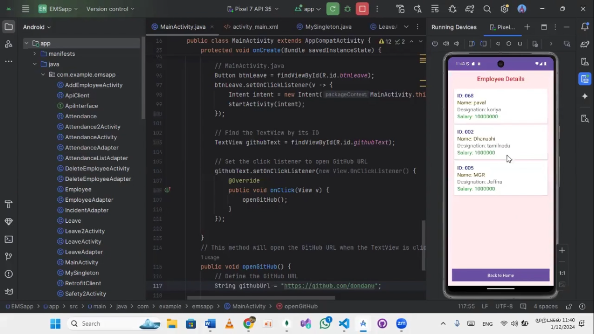

# Employee Management System (EMS)

The **Employee Management System (EMS)** is a comprehensive solution designed to streamline employee management processes for organizations. It integrates both web-based and mobile platforms for efficient and flexible usage.

## 🌟 Features
- **Employee Data Management:** Add, update, view, and delete employee details efficiently.
- **Attendance Management:** Track employee attendance automatically and manage records.
- **Salary Management:** Calculate and update salaries, including performance-based increments.
- **Task and Project Management:** Assign tasks and track project progress with ease.
- **Welfare Management:** Manage employee benefits such as health, insurance, food, visa, and loans.
- **Safety Management:** Ensure safety protocols are maintained in the workplace.
- **Mobile App:** Perform key functions such as viewing, adding, updating, and deleting employee data on the go.
- **Secure Login:** Admin login for secured access to the system.

---

## 🛠️ Technologies Used
- **Frontend:** HTML, CSS, JavaScript
- **Backend:** Node.js
- **Database:** MongoDB
- **Mobile App:** Android (Java, XML)
- **Tools:** Figma (UI Design), Postman (API Testing)

---

## 📸 Screenshots

### Employee Data Management


### Attendance Management


### Salary Management


### Welfare Management


### Task and Project Management


### Safety Management


### Mobile App



### Login Page


### MongoDB Data


---

## 🚀 How to Use
1. Clone the repository:  
   ```bash
   git clone 

2. Navigate to the project directory:
   ```bash
   cd employee-management-system

4. Install dependencies:
   ```bash
   npm install

6. Start the server:
   ```bash
   npm start

8. Access the web app:
   ```bash
   Open http://localhost:3000 in your browser.

10. Run the mobile app in Android Studio to access mobile features.

   
📂 Repository Structure
    frontend/: Contains the web frontend files.
    backend/: Contains Node.js server and API code.
    mobile/: Contains the Android Studio project for the mobile app.
    screenshots/: Contains all screenshots used in the documentation.
  
🔗 Links
    LinkedIn Post: https://www.linkedin.com/posts/danu1999_employeemanagement-mobileapp-techdemo-activity-7275409056142409729-3slS?utm_source=share&utm_medium=member_desktop
